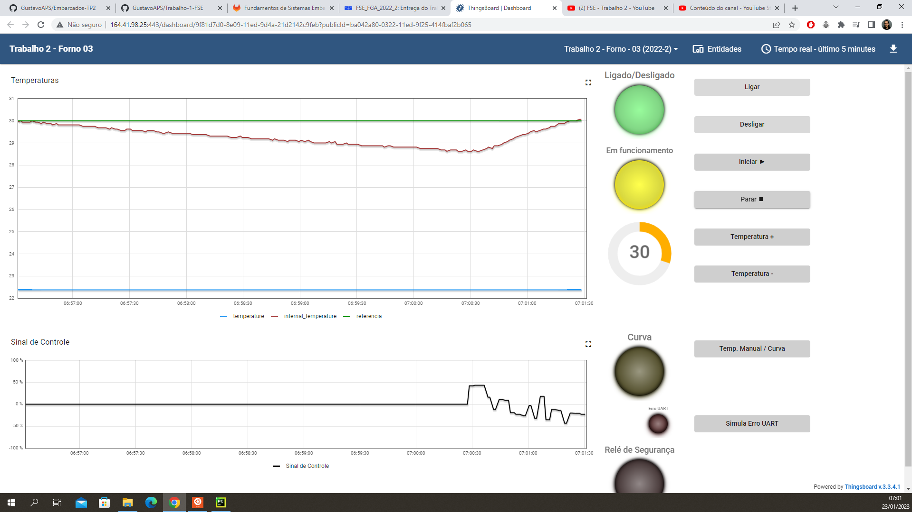
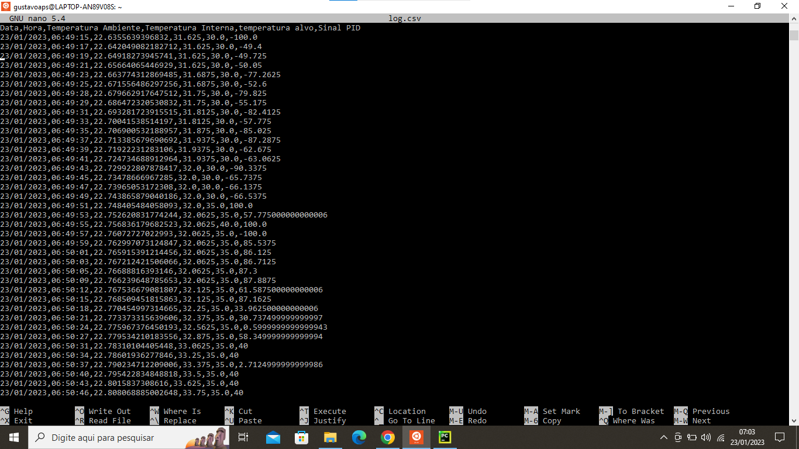
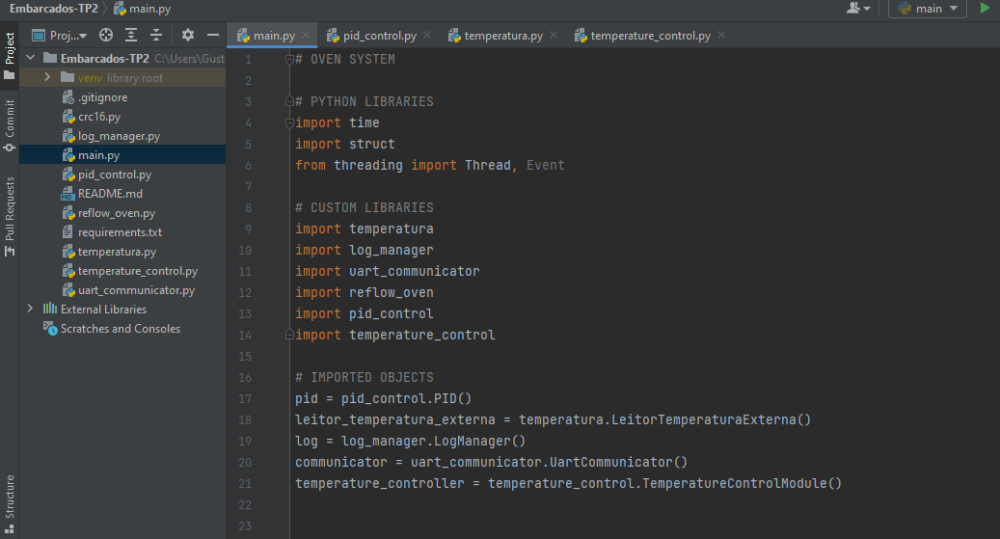

# Projeto 2 - FSE

## Introdução

Este trabalho tem por objetivo a implementação de um sistema (que simula) o controle de um forno para soldagem de placas de circuito impresso (PCBs). Abaixo vemos alguns exemplos de fornos comerciais para este propósito. 

## Dados do Aluno

| Nome                          | Matrícula  |
| ----------------------------- | ---------- |
| Gustavo Afonso Pires Severo   | 17/0034992 |


## Link da Apresentação

[](https://youtu.be/diz0Qlv3_9Y)

## Dependências

- pyserial
- smbus2
- rpi.bme280

## Como Executar

Ao realizar o clone deste repositório na Raspberry Pi, instale as dependencias listadas no arquivo 'requirements.txt' e a main vai estar pronta para execução:

```bash
$ pip install -r requirements.txt
$ python3 main.py
```

## Simulação


### Log



### Trecho de código



## Referências

[Controle Liga/Desliga - Wikipedia](https://pt.wikipedia.org/wiki/Controle_liga-desliga)  
[Controle PID - Wikipedia](https://pt.wikipedia.org/wiki/Controlador_proporcional_integral_derivativo)  
[Driver da Bosh para o sensor BME280](https://github.com/BoschSensortec/BME280_driver)  
[Biblioteca BCM2835 - GPIO](http://www.airspayce.com/mikem/bcm2835/)  
[Biblioteca WiringPi GPIO](http://wiringpi.com)  
[PWM via WiringPi](https://www.electronicwings.com/raspberry-pi/raspberry-pi-pwm-generation-using-python-and-c)

